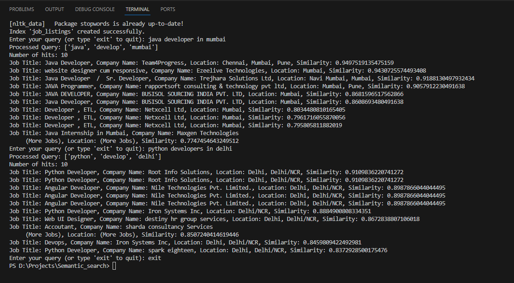

# Text Processing using Semantic Search with Elasticsearch Integration

## Overview
This Python script provides functionalities for processing job listing data and integrating it with Elasticsearch for semantic search capabilities. It includes text cleaning, tokenization, stop-word removal, stemming, Word2Vec model training, and setting up Elasticsearch for indexing and querying job listings.

## Requirements
- Python 3.x
- Libraries: NLTK, pandas, Gensim, Elasticsearch, numpy
- Elasticsearch Server

## Installation
1. Install required Python packages:
   ```bash
   pip install nltk pandas gensim elasticsearch numpy
   ```

2. Download necessary NLTK data:
   ```python
   import nltk
   nltk.download('punkt')
   nltk.download('stopwords')
   ```

## Usage
1. **Data Cleaning:** `clean_text` function cleans the text data from a CSV file. It standardizes new lines and spaces, and handles missing values.

2. **CSV Loading:** `load_csv` function reads a CSV file and applies the cleaning function to specified columns.

3. **Text Preprocessing:** `preprocess_document` performs tokenization, stop-word removal, and stemming on the provided text.

4. **Word2Vec Model Training:** `train_word2vec_model` trains a Word2Vec model on preprocessed text documents.

5. **Elasticsearch Setup:** `setup_elasticsearch` configures the connection to the Elasticsearch server.

6. **Index Creation:** `create_index` function creates an index in Elasticsearch with predefined settings.

7. **Data Indexing:** `index_data` indexes the preprocessed job listing data into Elasticsearch.

8. **Semantic Search:** `semantic_search` performs a query on the indexed data, leveraging the Word2Vec model for enhanced search capabilities.

9. **Main Execution:** Run the script to load data, preprocess it, setup Elasticsearch, and perform semantic searches.

## Configuration
- Update Elasticsearch host, port, and credentials in `setup_elasticsearch` function.
- Modify CSV file path and column names in `load_csv` and `index_data` as per your dataset.

## Example Output
Below is a screenshot of the terminal output after performing a semantic search for job listings:



## Note
Ensure Elasticsearch is running and accessible before executing the script. Adjust configurations and data paths as per your environment.
